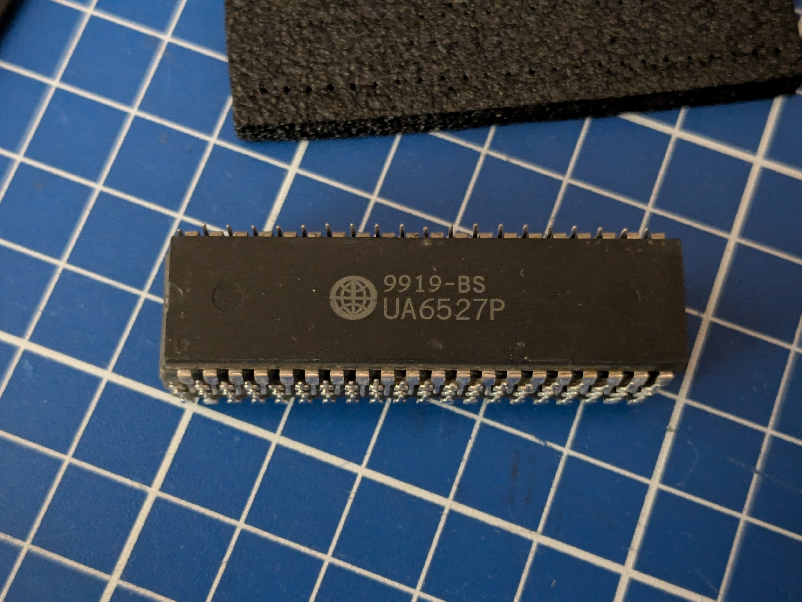

# Famiclone Dendy CPU clock multiplier

## DISCLAIMER

Any use of this project is **under your own responsibility**.
You will be responsible of checking the correct construction and functionality of your board.
By using this project You will agree that I cannot be held responsible if it will destroy any of your devices, damage your computer, burn down your house or whatever.

## Introduction

This board is a clock multiplier for cheap Dendy Famiclone CPUs, so they can be used in NTSC systems.

You can read about Dendy Famiclones timings [here](https://forums.nesdev.org/viewtopic.php?t=20931).

Fundamentally, NTSC and "Dendy" Famicoms have the same CPU clock / PPU clock ratio of 1:3, but Dendys are meant to work with 26.601712 Mhz frequency,
instead of the standard 21.47727 Mhz frequency for NTSC Famicoms/NES.

NTSC CPUs have an internal clock divisor of 12 (21.47727 / 12 ~= 1.790Mhz), while Dendy CPUs (except for older models) have a divisor of 15 (26.601712 / 15 ~= 1.773Mhz).
The rest of the core should be the same. Hopefully.

This board should bridge the gap making a cheap Dendy CPU work on an NTSC system by multiplying the input clock of the CPU by 1.25: 21.47727 x 1.25 = 26.8465875, which,
divided by 15 yields ~1.789Mhz, almost the same as the NTSC CPU.

The board takes the input clock, divides it by 4 using a 74'74, then multiplies the result by 5 using an ICS501 PLL, 5/4 is 1.25 :)

### Ordering the boards

You can order the board for this project at [PCBWay](https://www.pcbway.com/project/shareproject/MiniPerformer_d2c49c46.html) and support me or download 
the gerbers and have them printed wherever you like!!!

## Hardware

The board was designed with [KiCad](https://kicad.org/) EDA.

### Bill of Materials

| Component              | Qty | Type / Value                                            | Notes                                                                |
| ---------------------- | --- | ------------------------------------------------------- | -------------------------------------------------------------------- |
| C1                     |  1  | 10nF/16V ceramic cap, 0805                              |                                                                      |
| C2                     |  1  | 100nF/16V ceramic cap, 0805                             |                                                                      |
| C3, C4                 |  2  | 220pF/16V ceramic cap, 0805                             | Optional, install only if you wish to decouple the clocks. Not needed in my tests. |
| R1, R2                 |  2  | 150K resistor, 0805                                     | Optional, install only if you wish to decouple the clocks. Not needed in my tests. |
| U1                     |  1  | 74HC/HCT/LS74, SOIC-14                                  | Bypassing the input clock decoupling I was able to use an 'HC on a Famicom  |
| U2                     |  1  | ICS501 PLL, SOIC-8                                      |                                                                      |

### Assembly

If you don't need to decouple the input and output clocks, you can leave out C3, C4, R1 and R2, and just close the JP1 and JP2 bridges. The rest of the components are needed.

The board is meant to be soldered on the underside of the motherboard, right under the CPU. I do recommend to put the CPU in a socket if it is not already.

Also, note that the ~26Mhz clock getting to the CPU must be intercepted and interrupted. It's quite easy to do on a Famicom, as it is sufficient to lift a leg of the decoupling capacitor C9.
The ~26Mhz clock must then be fed to the multiplier via pad J1. The empty pad that housed C9, on the Side of the Q3 transistor, is perfect for this.
In case you are installing this in a Famiclone/NES, you will have to change the location where you tap the signal from.

Note that the part of the PCB without components is the part that must face the motherboard. It is a good idea to put some tape between this PCB and the motherboard, to avoid potential shorts.

## Compatibility

I'll keep this table updated when I test new CPUs with this adapter.

| CPU Type  | Compatible | Notes                                           |
| --------- | ---------- | ----------------------------------------------- |
| TA-03NP1  | ❌         | Works, but has severe glitching and speed issues in some games  |
| UA6547P (old model, /16 divisor) | ❌ |  Works, but has severe glitching in games  |
| UA6547P (/15 divisor) | ✔️ | It Works! |

